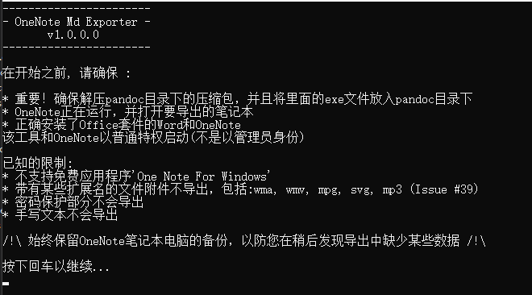
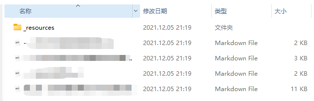

### 软件介绍

---

1. 一款能够将OneNote笔记直接导出成markdown和Joplin格式的软件，我在原作者的程序基础上添加了一些功能。

2. OneNote to markdown原理：其实是将OneNote笔记先导出成Word文档，之后通过pandoc.exe将word转化为markdown，将图片和附件放在一个resource文件夹中。

3. 程序的exe文件位于：Release\net5.0\win-x86\\**OneNoteMdExporter.exe**
   
4. 导出路径为：Release\net5.0\win-x86\\Exports
   
5. #### 注意！！！ 一定要将解压pandoc目录下的压缩包，并且将里面的exe文件放入pandoc目录下，不然程序会卡死。

---


### 改进了什么？

---

1. 添加了中文语言文件，让整个流程都是中文

2. 原作者设计是一个笔记本的所有图片都存放在同一个文件夹，文件夹路径为:"../../\_resource"。但是对我来说这非常不方便，所以我实现了，每一个分区都拥有独立的"_resource"文件夹存放图片文件。

3. 添加了一些中文注释，由于我常年写的都是C语言，所以C#和代码水平均有限，可能有一些注释是错误的，还请各位大佬见谅。

4. 该程序遵守GNU GPL V3开源协议，引用该程序都需要开源并且继续沿用该协议

5. 改进效果：

   

   

### 吐槽
---
1. 这个作者设置路径，就是一直在套娃，搞得我修改代码起来非常痛苦
2. 为了这个小小的功能改了我2天时间，如果对您有帮助的话，还请你们能够给我个**star**，谢谢各位大佬。

### 修改位置：

---

1.  在Resources文件夹下添加了”trad.zh.json“支持中文语言的文件
2.  GetAttachmentFilePathOnPage(Attachement attachement)：定义了一个新的函数，目的是为了实现文件夹的迁移。
3.  void PreparePageExport(Page page)：修改了一下该函数，让创建分区文件夹的时候，同时添加一个”\_resources文件夹“
4.  ExportServiceBase.cs文件下的void ExportPage(Page page)，注释掉了原作者的代码，让其不会保存word文档。
5.  string GetResourceFolderPath(Node node)：我将以前保存图片的文件夹变为了存放文件的文件夹。

### 代码的主要流程：

---

#### 	主要文件介绍：

1. ExportServiceBase.cs：是导出笔记的实现文件。导出onenote的基类，根据导出格式的不同，会用到MdExportService.cs、。。。override的函数。

2. ./Resources/trad.{lang}.json：里面是关于提示语的文件，修改语言用的

3. Program.cs：就是主程序入口

---
   #### 主要流程：

   1.  ExportNotebook函数：在ExportServiceBase.cs文件

       1.  notebook.ExportFolder; //创建总文件夹

       2.  CleanUpFolder(notebook); //创建笔记本名字的文件夹

       3.  Path.Combine(node.GetNotebook().ExportFolder, "resources"); // 创建resource文件夹

   2.  ExportNotebookInTargetFormat(notebook, sectionNameFilter, pageNameFilter) : 抽象函数，在MdExportService.cs 里有具体的函数

       1. //获取所有的节和节组

   3. ExportPage(Page page) //导出页面，在ExportServiceBase.cs文件

      1. //PreparePageExport(page); //创建页面文件夹
      2. //请求OneNote将页面导出为DocX文件
      3. //利用PanDoc.exe将Word转为Md；

   4. ExtractImagesToResourceFolder：//保存图片到resource文件夹，在ExportServiceBase.cs文件

      ​	1. //通过遍历，保存图片到指定文件夹

   5. ExportPageAttachments：//导出所有的文件附件，并得到更新的页面markdown，在ExportServiceBase.cs文件


### 原作者和原程序

---

[alxnbl/onenote-md-exporter: ConsoleApp to export OneNote notebooks to Markdown formats (github.com)](https://github.com/alxnbl/onenote-md-exporter)

### 两种格式的效果：

---

| Export format:                  | Markdown                                                     | Joplin                                                       |
| ------------------------------- | ------------------------------------------------------------ | ------------------------------------------------------------ |
| Hierarchy of sections           | ✅ Folder hierarchy                                           | ✅ Notbook hierarchy                                          |
| Page ordering inside a section  | 🔴 Lost                                                       | ✅                                                            |
| Page hierarchy (level)          | ✅                                                            | ✅                                                            |
| Attachments                     | 🟠 File of certain extensions are lost (wma, wmv, mpg, svg, mp3) | 🟠 File of certain extensions are lost (wma, wmv, mpg, svg, mp3) |
| Image                           | ✅                                                            | ✅                                                            |
| Table                           | ✅                                                            | ✅                                                            |
| Table with nested image         | 🟠 Html table, image lost                                     | 🟠 Html table, image lost                                     |
| Font color and background color | 🔴                                                            | 🔴                                                            |
| Drawing                         | 🟠 Flattened as image                                         | 🟠 Flattened as image                                         |
| Handwriting                     | 🔴 Lost                                                       | 🔴 Lost                                                       |
| Text tags (task, star...)       | 🔴 Lost                                                       | 🔴 Lost                                                       |
| Password protected sections     | 🔴 Lost                                                       | 🔴 Lost                                                       |
| Notebook internal link          | 🔴 onenote:// url                                             | 🔴 onenote:// url                                             |

# Licence

Released under the GPL, version 3.

This software carries no warranty of any kind. Some data can be lost during the export process. I recommend to review your notes after export and keep a backup of your OneNote notebooks just in case.

### Pandoc licence terms

---

OneNote Md Exporter uses PanDoc universal markup converter.

Pandoc is available at https://github.com/jgm/pandoc

Pandoc is released under the following licence terms, full licence details can be found on the pandoc site.

```
© 2006-2021 John MacFarlane (jgm@berkeley.edu). Released under the GPL, version 2 or greater. This software carries no warranty of any kind.
```

#### Data:

---

**2021.12.05**


