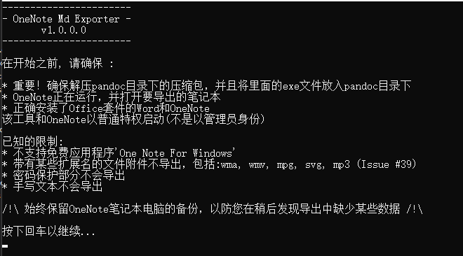
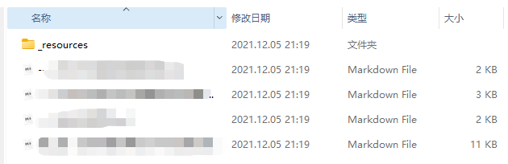

-   Onenote to markdown原理：其实是将OneNote笔记先导出成Word文档，之后通过pandoc.exe将word转化为markdown，将图片和附件放在一个resource文件夹中。

 

-   主要流程：

1.  ExportNotebook函数：在ExportServiceBase.cs文件

    1.  notebook.ExportFolder; //创建总文件夹

    2.  CleanUpFolder(notebook); //创建笔记本名字的文件夹

    3.  Path.Combine(node.GetNotebook().ExportFolder, "resources"); // 创建resource文件夹

 

2.  ExportNotebookInTargetFormat(notebook, sectionNameFilter, pageNameFilter) : 抽象函数，在MdExportService.cs 里有具体的函数

    1.  //获取所有的节和节组

 

3.  ExportPage(Page page) //导出页面，在ExportServiceBase.cs文件

//PreparePageExport(page); //创建页面文件夹
//请求OneNote将页面导出为DocX文件
//利用PanDoc.exe将Word转为Md；
 

4.  ExtractImagesToResourceFolder：//保存图片到resource文件夹，在ExportServiceBase.cs文件

//通过遍历，保存图片到指定文件夹
 

5.  ExportPageAttachments：//导出所有的文件附件，并得到更新的页面markdown，在ExportServiceBase.cs文件

 

-   主要文件

1.  ExportServiceBase.cs：是导出笔记的实现文件。导出onenote的基类，根据导出格式的不同，会用到MdExportService.cs、。。。override的函数。

2.  ./Resources/trad.{lang}.json：里面是关于提示语的文件，修改语言用的

3.  Program.cs：就是主程序入口

 

-   修改位置：

    -   修改了什么？

    <!-- -->

    -   添加了中文语言文件，让整个流程都是中文

    -   原作者设计是一个笔记本的所有图片都存放在同一个文件夹，文件夹路径为:../../\_resource。但是对我来说这非常不方便，所以我实现了，每一个分区都拥有独立的_resource文件存放图片文件。

    -   添加了一些中文注释，由于我常年写的都是C语言，所以C#和代码水平均有限，可能有一些注释是错误的，还请各位大佬见谅。

 

-   修改位置：

1.  在Resources文件夹下添加了trad.zh.json中文文件

2.  GetAttachmentFilePathOnPage(Attachement attachement)：定义了一个新的函数，目的是为了实现文件夹的迁移。

3.  void PreparePageExport(Page page)：修改了一下该函数，让创建分区文件夹的时候，同时添加一个”\_resources文件夹“

4.  ExportServiceBase.cs文件下的void ExportPage(Page page)，注释掉了原作者的代码，让其不会保存word文档。

5.  string GetResourceFolderPath(Node node)：我将以前保存图片的文件夹变为了存放文件的文件夹。

 

-   吐槽

1.  这个作者设置路径，就是一直在套娃，搞得我修改代码起来非常痛苦

2.  为了这个小小的功能改了我2天时间，如果对您有帮助的话，还请你们能够给我个star，谢谢各位大佬。

 

-   效果图：

1.  中文：

2.  文件夹的位置：

 
 
 
 
 
 
 
 
 
 
 
